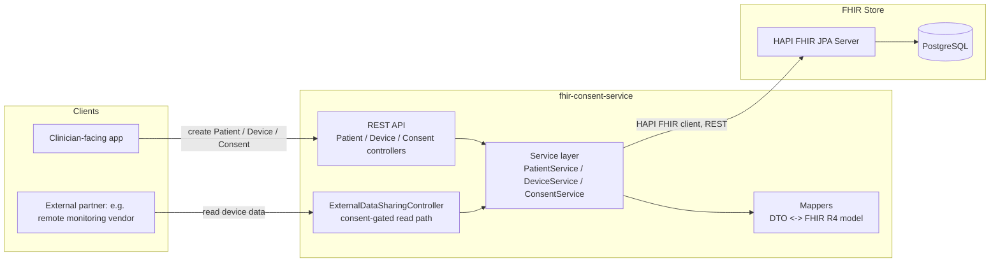
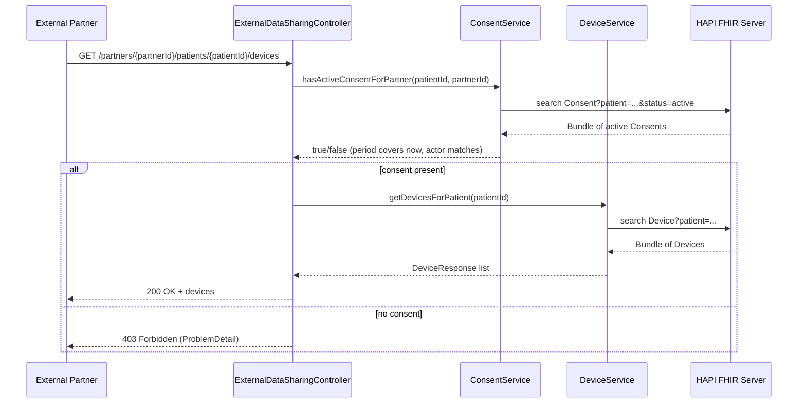

# Architecture

## Component overview

## Resource model

| FHIR Resource | Represents | Key fields used |
|---|---|---|
| `Patient` | The person receiving care | `identifier` (MRN), `name`, `birthDate`, `gender` |
| `Device` | The insulin pump | `type` (SNOMED CT `469756000`), `patient` reference, `udiCarrier`, `manufacturer`/`modelNumber`/`serialNumber`/`lotNumber`, `version` |
| `Consent` | The patient's grant of data access to an external partner | `patient` reference, `status`, `scope`=`patient-privacy`, `category`=`IDSCL`, `provision.type`=`permit`, `provision.period`, `provision.actor` (partner, role `IRCP`), `provision.purpose` (v3 ActReason), `provision.class` (project-specific data categories) |

Device is intentionally modeled as a *generic* FHIR `Device` with a SNOMED CT
type coding rather than a custom resource/profile. That keeps it queryable by
any other system using standard `Device` search parameters, at the cost of
not having pump-specific fields (e.g. reservoir volume, basal rate schedule)
be strongly typed. A production system would likely publish a FHIR
`StructureDefinition` profile constraining `Device` for insulin pumps
specifically (see "Not Yet Implemented" below).

## Consent-gated data access flow

## Not yet implemented (explicitly out of scope for this example)

These are called out because a senior engineer reviewing this repo would
expect them to be named, not silently missing:

- **AuthN/AuthZ.** There is no OAuth2/SMART-on-FHIR bearer token validation
  on any endpoint. `partnerOrganizationId` in the URL is trusted as-is; in
  production this must come from a verified token (e.g. a SMART Backend
  Services client credentials grant scoped to that partner).
- **Audit logging.** Every consent check and data read should emit an
  `AuditEvent` FHIR resource (or equivalent) for compliance and breach
  investigation purposes.
- **Consent conflict/precedence rules.** This example assumes at most one
  relevant active Consent per (patient, partner) pair. Real consent
  management must handle overlapping, conflicting, or superseding consents.
- **Resilience.** No retry/circuit-breaker around the FHIR client calls.
- **Formal FHIR profiles.** Resources are shaped in code (see mappers) rather
  than validated against published `StructureDefinition`/`Consent` profiles.
